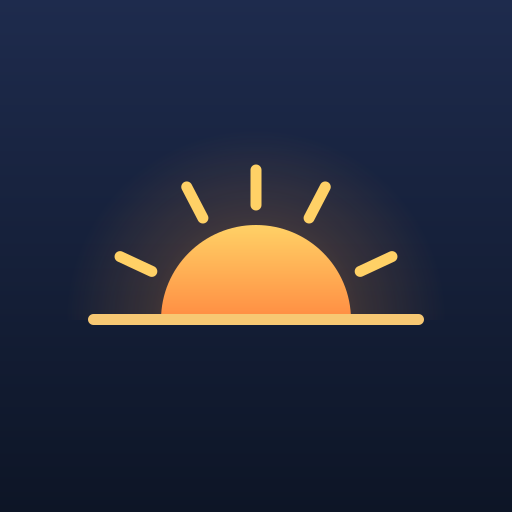

# El logo

Un sol saliendo sobre el horizonte: un día más.

## Los archivos

| Archivo | Para qué |
|---|---|
| `logo.svg` | El original. Todo lo demás sale de aquí |
| `logo-adaptativo-frente.svg` / `logo-adaptativo-fondo.svg` | Las dos capas del icono de Android, para verlas fuera de Android Studio |
| `android/drawable/*.xml` | El icono de verdad: vectorial, incluido el monocromo de Android 13+ |
| `android/mipmap-anydpi-v26/ic_launcher.xml` | Une las dos capas |
| `android/mipmap-*/` | PNG de respaldo para Android 7 y anteriores |
| `ic_launcher-playstore.png` | El de 512×512 de la ficha de Play |
| `generar-iconos.sh` | Regenera los PNG desde `logo.svg` |

Cómo instalarlo en el módulo de Android: al final de
[../docs/checklist-produccion.md](../docs/checklist-produccion.md).

## Los colores

| | Hex | Dónde |
|---|---|---|
| Cielo, arriba | `#1E2B4D` | fondo |
| Cielo, abajo | `#0D1526` | fondo |
| Sol, arriba | `#FFD166` | sol y rayos |
| Sol, abajo | `#FF8C42` | sol |
| Horizonte | `#F7C873` | la línea |
| Resplandor | `#FF9A3C` | al 45% de opacidad y bajando a 0 |

Sirven también para el tema de la app: `#0D1526` de fondo oscuro y `#FF8C42`
como color de acento.

## Tres cosas que no hay que romper al editarlo

**Nada de filtros ni desenfoques.** Los *vector drawables* de Android no saben
dibujarlos. El resplandor es un degradado radial justo por eso, y gracias a eso
el SVG y el icono de Android son el mismo dibujo trazado por trazado, no dos
que se parecen.

**El frente va reencuadrado, no a sangre.** Android recorta el icono con la
forma que quiera el fabricante y solo garantiza el 66% central. Por eso
`logo-adaptativo-frente.svg` escala el dibujo al 85% y lo centra; si usaras
`logo.svg` tal cual, con máscara redonda se cortarían los extremos del
horizonte. La cuenta está comentada dentro del archivo.

**Sin texto dentro.** A 48 píxeles —el tamaño real en una pantalla de baja
densidad— cualquier palabra se convierte en una mancha. La silueta de medio
disco sobre una línea se reconoce a ese tamaño y también en monocromo, que es
lo que exige el icono temático de Android 13.

Si cambias `logo.svg`, corre `./generar-iconos.sh` y actualiza a mano los tres
XML de `android/drawable/` — comparten las coordenadas con el SVG a propósito,
para que la comparación se pueda hacer a ojo.
